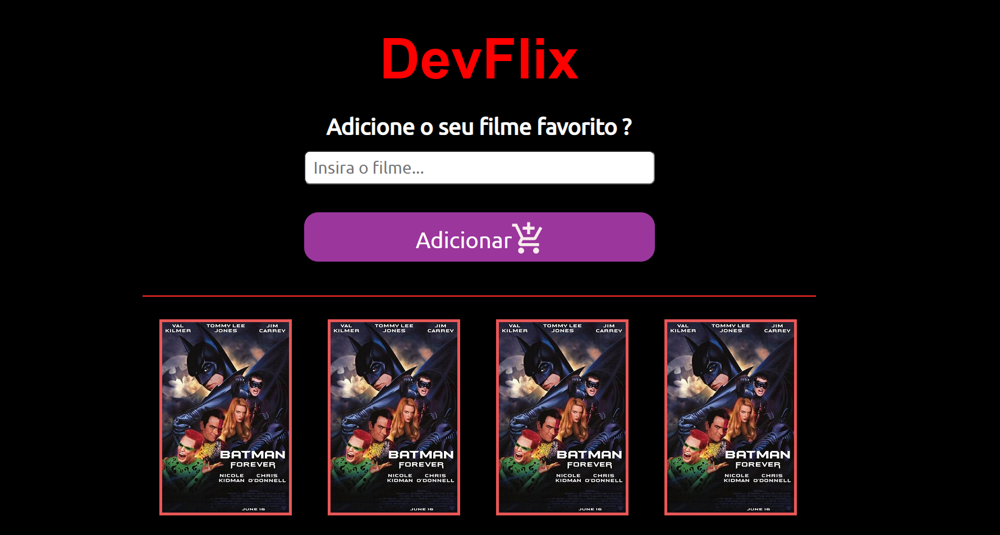

# título: Site de Filmes

## Site Criado a partir do Figma 
- Esse site foi criado através de template criado na ferramenta do figma.
- Com o figma podemos criar um layout agradavel e disponivel para adicionar filmes a nossa aplicação.
- O site foi codificado apenas com HTML e CSS com o intuito de mostrar a interface feita, por enquanto ainda não tem a funcionalidade interagindo com o usuário.

# Imagem do site

## Tecnologias utilizadas
- Html
- CSS